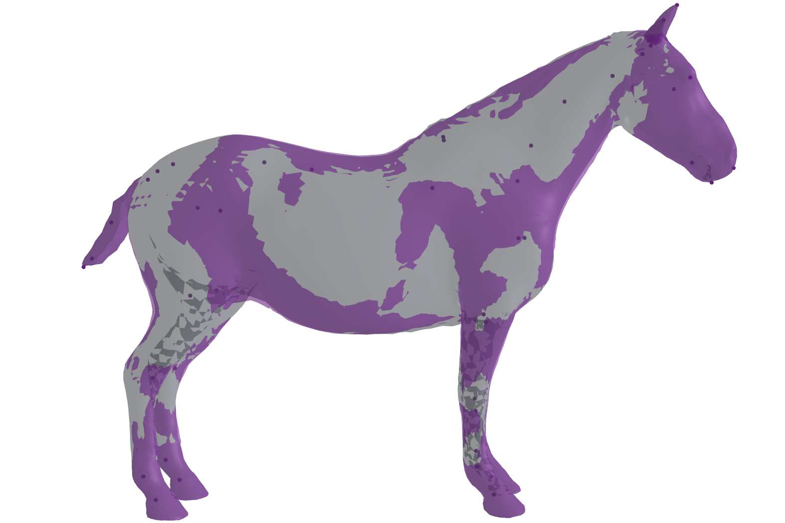

# VAREN: Very Accurate and Realistic Equine Network

[ [Project Page](https://varen.is.tue.mpg.de/) ][ [Paper](https://openaccess.thecvf.com/content/CVPR2024/papers/Zuffi_VAREN_Very_Accurate_and_Realistic_Equine_Network_CVPR_2024_paper.pdf) ][ [Training Code](https://github.com/silviazuffi/varen) ]

This respository contains a user-friendly, light-weight implementation similar to [SMPLX](https://github.com/vchoutas/smplx/) of VAREN from on the paper: *VAREN: Very Accurate and Realistic Equine Network* by Silvia Zuffi, Ylva Mellbin, Ci Li, Markus Hoeschle, Hedvig Kjellström, Senya Polikovsky, Elin Hernlund, and Michael J. Black, CVPR 2024.


For the original code base, including the training methods, please see the [training code](https://github.com/silviazuffi/varen).

Visualisation output from `example/visualise_model.py`. The image depicts two overlapping meshes: base model (grey) and the model with muscle deformations (purple).

---

## Table of Contents
  * [License](#license)
  * [Description](#description)
  * [News](#news)
  * [Installation](#installation)
  * [Downloading the model](#downloading-the-model)
  * [Loading VAREN, HSMAL and SMAL](#loading-VAREN-HSMAL-and-SMAL) 
    * [Model loading](#model-loading)
  * [Example](#example)
  * [Citation](#citation)
  * [Acknowledgments](#acknowledgments)
  * [Contact](#contact)

## License

Software Copyright License for **non-commercial scientific research purposes**.
Please read carefully the [terms and conditions](https://github.com/TheDepe/VAREN/blob/master/LICENSE) and any accompanying documentation before you download and/or use the VAREN/HSMAL/SMAL model, data and software, (the "Model & Software"), including 3D meshes, blend weights, blend shapes, textures, software, scripts, and animations. By downloading and/or using the Model & Software (including downloading, cloning, installing, and any other use of this github repository), you acknowledge that you have read these terms and conditions, understand them, and agree to be bound by them. If you do not agree with these terms and conditions, you must not download and/or use the Model & Software. Any infringement of the terms of this agreement will automatically terminate your rights under this [License](./LICENSE).


## Description

*VAREN* is a equine body model with shape parameters trained on real horses. *VAREN* uses standard vertex based linear blend skinning with learned corrective blend
shapes, has N = 13,873 vertices and K = 38 joints,
which include joints for the neck, jaw, ears and tail and hooves. 
VAREN is defined by a function M(θ, β), where θ is the pose parameters, β the shape parameters.

## News

- 16 January 2025: This repo goes live.

## Installation

To install the model please follow the next steps in the specified order:

Clone this repository and install it using the *setup.py* script: 
```Shell
git clone https://github.com/TheDepe/VAREN
cd VAREN
pip install -e .[all] 
```

or 

Install directly from github: 
```Shell
pip install git+https://github.com/TheDepe/VAREN
```

Note: pip install varen not yet available


## Downloading the model

To download the *VAREN* model go to [this project website](https://varen.is.tue.mpg.de/) and register to get access to the downloads section. 

To download the *HSMAL*: To be made available. 

To download the *SMAL* model go to [this](https://smal.is.tue.mpg.de/) (general quadruped model) and register to get access to the downloads section. 


## Model loading
```
models
├── varen
│   ├── VAREN.pkl
│   └── varen_muscle_vertex_labels.pkl
│   └── varen.pth
├── hsmal
│   └── HSMAL.pkl
└── smal
    └── SMAL.pkl
```

## Example

After installing the *VAREN* package and downloading the model parameters you should be able to run the `visualise_model.py` script to visualise the results. For this step you hve to install the [trimesh](https://trimsh.org/) package (installed directly via `pip install -e .[all]`. Will need to install separately if installed directly from this repository).

You can run the script via:

```
python examples/visualise_model.py --model_path /path/to/downloaded/models
```
Optionally, you can save the meshes as follows:
```
python examples/visualise_model.py --model_path /path/to/downloaded/models --output_path /path/to/save/meshes --save_meshes
```

## Using the model

Usage of the model is similar to that of [smplx](https://github.com/vchoutas/smplx/). VAREN (or HSMAL/SMAL) can be intialised as follows:
```
varen = VAREN(model_path)
``` 
or optionally without neural muscle deformations:
```
varen = VAREN(model_path, use_muscle_deformations=False)
```

A forward pass can be called simply by (with or without arguments):
```
output = varen(body_pose=pose, betas=shape)
```

Output elements can be accessed via (e.g):
```
output.vertices
output.global_orient
output.body_pose
output.body_betas
output.muscle_betas
```


## Citation

If you found the model or any of the pieces of cod euseful in this repo, please cite the paper:

```
@inproceedings{Zuffi:CVPR:2024,  
  title = {{VAREN}: Very Accurate and Realistic Equine Network},  
  author = {Zuffi, Silvia and Mellbin, Ylva and Li, Ci and Hoeschle, Markus and Kjellström, Hedvig and Polikovsky, Senya  and Hernlund, Elin and Black, Michael J.},  
  booktitle = {IEEE/CVF Conference on Computer Vision and Pattern Recognition (CVPR)},  
  pages = {},
  month = Jun,
  year = {2024}
}

```
## Contact

The code of this repo was implemented by [Dennis Perrett](dennis.perrett@tuebingen.mpg.de).

For questions on this implementation, please contact [Dennis](dennis.perrett@tuebingen.mpg.de) directly, or for questions on the model and its abstract implementation, please contact [Silvia Zuffi](silvia.zuffi@tuebingen.mpg.de)